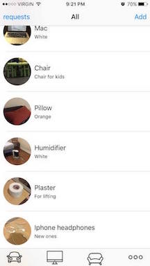

#Tradey 
###Libraries used:  
1- Firebase Database and Storage  
2- Digits  
###App's Main Features:  
1- Request/Accept tool for trading items.   
2- Can only contact the "Tradeeys" if the trade is accepted by both ends.
3- User authentication via phone numbers.  
4- Immitated social apps UX to give it a friendly tone.
###TODOS:
1- Add report tool to remove spam.  
2- Add tutorial steps for first use.  
3- Check its scalability.  
4- Refactor the UI of the requests page. 
  
  
  
  
  
  
  
  
